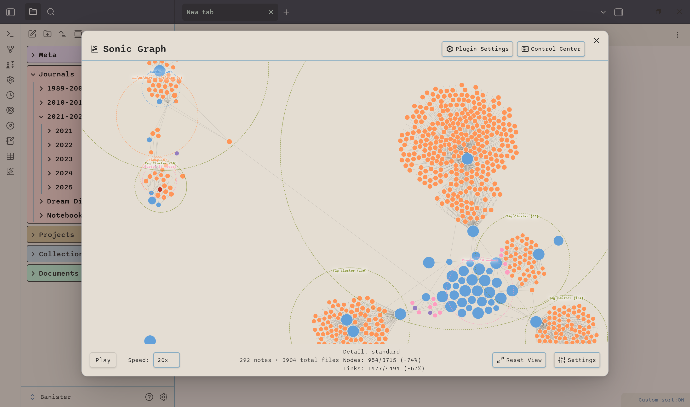
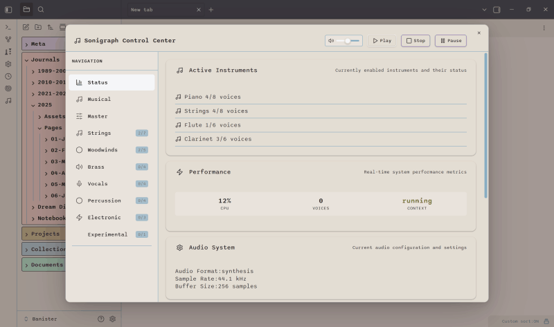

# Sonigraph

**Transform your knowledge graph into immersive orchestral soundscapes.**

Sonigraph is an Obsidian plugin that maps the visual structure of your knowledge graph to rich musical parameters, creating dynamic orchestral compositions with 34 instruments, continuous audio layers, advanced effects processing, and real-time audio synthesis. Features Freesound.org integration for high-quality environmental samples and intelligent content-aware mapping.

<table align="center">
<tr>
<td align="center" width="50%">

 
<em>Sonic Graph: Smart Clustering & Visual Enhancement</em>
</td>
<td align="center" width="50%">

 
<em>Control Center: 34-Instrument Orchestra Management</em>
</td>
</tr>
</table>

## 🎼 Features

### Core Sonification
- **Graph-to-Music Mapping**: Convert note connections into orchestral compositions
- **34-Instrument Orchestra**: Full orchestral palette including strings, woodwinds, brass, percussion, vocals, electronic synthesis, and environmental sounds
- **Real-time Audio Synthesis**: Generate music directly within Obsidian using Tone.js Web Audio API
- **Intelligent Musical Mapping**: Sophisticated algorithms that translate graph structure to musical elements

### Continuous Audio Layers (v0.12.0)
- **Ambient Layer System**: Genre-based continuous background soundscapes that evolve with vault state
- **Rhythmic Layer Engine**: Activity-responsive percussion patterns that sync with vault interactions
- **Harmonic Pad Layer**: Cluster-based harmony generation with chord progressions and musical theory
- **13 Musical Genres**: Ambient Drone, Cinematic Orchestral, Jazz Lounge, Electronic Pulse, Nature Soundscape, and more
- **Freesound.org Integration**: Curated high-quality audio samples with token-based API authentication
- **Sample Management System**: Intelligent caching, preloading, and offline mode support

### Content-Aware Mapping
- **File Type Intelligence**: Automatic instrument assignment based on note types (markdown, images, PDFs, etc.)
- **Tag-Based Semantics**: Musical mood and instrument selection driven by vault tags
- **Folder Hierarchy Mapping**: Folder structure influences orchestral arrangement and grouping
- **Frontmatter Support**: Explicit instrument and mood control via note metadata
- **Connection Type Audio**: Different link types (wikilinks, embeds, tags) produce distinct musical elements

### Advanced Audio Engine
- **Sample-Based Synthesis**: High-quality orchestral samples with realistic articulation
- **Advanced Percussion Engine**: Physics-modeled timpani, mallet instruments, and resonant gongs
- **Electronic Synthesis Suite**: Professional filter modulation, LFO control, and envelope shaping
- **Master Effects Processing**: Orchestral reverb hall, 3-band EQ, and dynamic compression

### Professional Effects & Routing
- **Per-Instrument Effect Chains**: Individual reverb, chorus, and filter processing for each instrument
- **11 Professional Presets**: Optimized effect configurations (Concert Hall, Jazz Club, Cathedral, etc.)
- **Smart Parameter Ranges**: Context-aware effect parameters that adapt to musical content
- **Enhanced Effect Routing**: Advanced signal flow with send/return busses and parallel processing

### Intelligent User Experience
- **Family-Organized Interface**: Instruments grouped by orchestral families for intuitive control
- **Performance Optimization**: Adaptive quality system with voice pooling and CPU monitoring
- **Real-time Audio Feedback**: Visual and auditory feedback during graph playback
- **Comprehensive Settings**: Detailed control over all 34 instruments and their parameters

### 🚀 Production Features

- **Sonic Graph Visualization**: High-performance interactive graph visualization with temporal animation
  - **Instant Loading Performance**: Optimized data processing using Obsidian's MetadataCache infrastructure
  - **Static Graph View**: D3.js force simulation displaying all vault files and connections
  - **Timeline Animation Mode**: Audio-synchronized chronological node appearance with intelligent spacing
  - **Timeline Granularity Controls**: Multi-level time granularity (Year, Month, Week, Day, Hour) with custom ranges
  - **Time Window Filtering**: Focus on specific time periods (All time, Past year, Past month, etc.)
  - **Smart Event Spreading**: Intelligent audio event distribution to prevent crackling from simultaneous triggers
  - **Professional Settings Panel**: Comprehensive configuration with 21+ settings, each with detailed tooltips
  - **Advanced Filtering**: Content exclusion system with native Obsidian autocomplete for folders and files
  - **Performance Optimizations**: Adaptive rendering modes and efficient data structures for large vaults
- **Enhanced Modal Interface**: Full-screen overlay settings panel with smooth transitions and responsive layout
- **Cross-Modal Navigation**: Seamless integration between Sonic Graph and Control Center interfaces

*Sonic Graph now delivers production-ready performance matching Obsidian's core Graph plugin.*

### 🎵 Audio Export (v0.12.1)

- **Professional Audio Export**: Export timeline animations as high-quality audio files
  - **Multiple Formats**: WAV (lossless) and compressed audio (M4A/AAC, WebM/Opus, OGG/Vorbis)
  - **Quality Presets**: High Quality, Standard, Small Size with configurable bitrates (128-320 kbps)
  - **Custom Time Ranges**: Export specific portions of timeline animations
  - **Metadata Support**: Add title, artist, album, year, genre, and comments to exports
- **Export Presets**: Save and load custom export configurations for quick access
- **Automatic Documentation**: Generate comprehensive markdown notes with all export settings
- **Progress Tracking**: Real-time progress feedback with cancellation support
- **File Management**: Intelligent file collision handling and automatic vault organization

*Export your sonic graphs as shareable audio files with professional quality settings.*

## 📦 Installation

**Recommended:** Install via [BRAT Plugin](https://github.com/TfTHacker/obsidian42-brat)
1. Install the BRAT plugin in Obsidian
2. Use BRAT to install from GitHub: `banisterious/obsidian-sonigraph`
3. Enable Sonigraph in Community Plugins settings

**Manual Installation:** Download the latest release and extract to your vault's plugins folder

---

## Support My Work

If you find this plugin useful, please consider supporting its development!

---

## 🎯 Current Status

**Current Version**: 0.12.1 (Production Ready)

✅ **Complete Audio Enhancement System**
- **Continuous Audio Layers**: Ambient, rhythmic, and harmonic background layers with 13 musical genres
- **Freesound Integration**: Token-based API with curated sample library and intelligent caching
- **Content-Aware Mapping**: File types, tags, folders, and frontmatter drive instrument selection
- **Musical Theory Integration**: Scale systems, chord progressions, and harmonic relationships
- **34 Orchestral Instruments**: Complete implementation across all families with environmental sounds
- **Advanced Synthesis Engines**: Percussion physics, electronic modulation, and sample-based orchestral voices
- **Master Effects Processing**: Orchestral-grade reverb, EQ, and compression with 11 professional presets
- **Performance Optimization**: Adaptive quality control, voice pooling, and resolved audio quality issues
- **Audio Export**: Professional audio export with WAV and compressed formats, metadata, and presets (v0.12.1)

## 🎼 Orchestral Instrument Families

### Strings (5 instruments)
- **Violin**, **Cello** - Traditional bowed strings
- **Harp** - Plucked strings with glissando effects
- **Guitar** - Steel-string acoustic with fingerpicking and strumming
- **Strings** - Full orchestral string section

### Woodwinds (4 instruments) 
- **Flute** - Pure tone with breath control
- **Clarinet** - Rich, woody timbre across registers
- **Saxophone** - Jazz-influenced with vibrato and growl
- **Oboe** - Piercing, nasal tone with expressiveness

### Brass (4 instruments)
- **Trumpet** - Brilliant, fanfare-capable lead voice
- **French Horn** - Warm, noble hunting horn character
- **Trombone** - Smooth glissando and powerful projection
- **Tuba** - Foundation bass with deep resonance

### Vocals (7 instruments)
- **Soprano** - High female voice with lyrical purity
- **Alto** - Rich contralto with warm chest tones
- **Tenor** - Male lead voice with heroic quality
- **Bass** - Deep male voice with authoritative presence
- **Choir** - Mixed vocal ensemble
- **Vocal Pads** - Sustained vocal textures
- **Pad** - Ambient vocal synthesis

### Percussion (4 instruments)
- **Timpani** - Tuned kettle drums with pitch bending
- **Xylophone** - Bright mallet percussion with wood resonance
- **Vibraphone** - Metallic bars with motor tremolo
- **Gongs** - Large suspended cymbals with extended resonance

### Electronic (3 instruments)
- **Lead Synth** - Filter-swept lead with modulation
- **Bass Synth** - Sub-oscillator bass with envelope control
- **Arp Synth** - Arpeggiated patterns with sequencing

### Environmental (7 instruments)
- **Ocean Waves** - Rhythmic coastal surf with natural dynamics
- **Rain** - Gentle to heavy precipitation patterns
- **Forest** - Woodland ambience with subtle movement
- **Wind** - Atmospheric air movement and gusts
- **Thunder** - Low-frequency rumbles and distant storms
- **Fire** - Crackling flames with organic variation
- **Whale Song (Humpback)** - Oceanic vocalizations with ultra-long reverb

## 🎛️ Advanced Audio Features

### Master Effects Processing
- **Orchestral Reverb Hall**: Simulated concert hall acoustics with adjustable decay
- **3-Band EQ**: Bass boost, mid-range clarity, and treble enhancement
- **Dynamic Compressor**: Automatic level control for orchestral balance

### Performance Optimization
- **Adaptive Quality System**: Automatically adjusts audio quality based on CPU load
- **Voice Pooling**: Efficient voice management for complex orchestral arrangements  
- **Emergency Performance Mode**: Fallback mode for resource-constrained systems

### Enhanced Effect Routing
- **Per-Instrument Chains**: Individual effect processing for each of 34 instruments
- **Professional Presets**: 11 optimized configurations for different musical styles
- **Smart Parameter Ranges**: Context-aware effect parameters that adapt to content

## 🎯 Musical Mapping System

### Graph-to-Music Translation
- **Nodes → Instruments**: Map vault notes to orchestral instruments based on content analysis
- **Connections → Harmony**: Link relationships create harmonic progressions and chord structures
- **Graph Traversal → Composition**: Different algorithms generate musical sequences through connected notes
- **Node Properties → Articulation**: Tags, metadata, and content influence playing style and dynamics

### Content-Aware Intelligence
- **File Type Recognition**: Markdown, images, PDFs, audio, and video files trigger appropriate instrument families
- **Tag-Based Mapping**: Vault tags drive musical mood selection (contemplative, energetic, calm, etc.)
- **Folder Hierarchy**: Organizational structure influences orchestral grouping and arrangement
- **Frontmatter Control**: Explicit instrument and mood specification via note metadata
- **Connection Type Differentiation**: Wikilinks, embeds, and tag connections produce distinct musical elements

### Intelligent Sonification
- **Frequency-Based Assignment**: Distribute instruments across pitch ranges for optimal orchestral balance
- **Dynamic Voice Allocation**: Automatic instrument selection based on graph complexity and content type
- **Temporal Mapping**: Connection strength influences note duration and rhythmic patterns
- **Spatial Audio**: Graph layout translates to stereo positioning and reverb characteristics
- **Continuous Layer Evolution**: Background soundscapes respond to vault state, activity, and cluster density

## 🚀 Getting Started

### Quick Start
1. Install and enable the plugin in Obsidian
2. (Optional) Obtain a [Freesound.org API token](https://freesound.org/apiv2/apply) for continuous layer samples
3. Open the Audio Control Center from the ribbon or command palette
4. Configure continuous layers in the **Continuous Layers** tab (select genre, adjust intensity)
5. Set up content-aware mapping in the **Content Mapping** tab
6. Configure instruments in the family tabs (Strings, Brass, Environmental, etc.)
7. Adjust effects and presets in the **Master** tab
8. Play your knowledge graph with the **Play** button

### Freesound Integration Setup
Continuous audio layers use high-quality samples from Freesound.org:
1. Create a free account at [Freesound.org](https://freesound.org)
2. Apply for an API token at [freesound.org/apiv2/apply](https://freesound.org/apiv2/apply)
3. Enter your token in **Control Center → Freesound Integration** tab
4. Browse and download samples directly from the interface
5. Offline mode available after initial sample download

### Audio Control Center Tabs
- **Status**: Real-time system diagnostics and performance monitoring
- **Musical**: Set scales, tempo, and musical parameters
- **Continuous Layers**: Configure ambient/rhythmic/harmonic background layers (13 genres)
- **Content Mapping**: Set up file type, tag, and folder-based instrument assignment
- **Freesound Integration**: API authentication, sample browsing, and cache management
- **Master**: Global controls, master effects, and bulk operations
- **Strings**: String family instruments (violin, cello, guitar, harp, strings)
- **Woodwinds**: Woodwind family (flute, clarinet, saxophone, oboe)
- **Brass**: Brass family (trumpet, french horn, trombone, tuba)
- **Vocals**: Vocal family (choir, soprano, alto, tenor, bass, vocal pads, pad)
- **Percussion**: Percussion family (timpani, xylophone, vibraphone, gongs)
- **Electronic**: Electronic family (lead synth, bass synth, arp synth)
- **Environmental**: Environmental sounds (ocean, rain, forest, wind, thunder, fire, whale song)

## 🤝 Contributing

Sonigraph has reached production status with comprehensive orchestral capabilities. Contributions are welcome for:

- New instrument synthesis methods
- Additional effect processing algorithms  
- Enhanced graph-to-music mapping strategies
- Performance optimizations for large vaults
- UI/UX improvements and accessibility features

1. Review the [Development Roadmap](docs/planning/development-roadmap.md) for development roadmap
2. Check the [implementation documentation](docs/architecture/overview.md)  
3. Open an issue or submit a pull request

## 📄 License

MIT License - see [LICENSE](LICENSE) for details.

## 🙏 Acknowledgments

- Built for [Obsidian](https://obsidian.md)
- Audio synthesis powered by [Tone.js](https://tonejs.github.io/)
- Inspired by data sonification and knowledge visualization research

---

**Note**: This plugin is not affiliated with or endorsed by Obsidian.md. 
