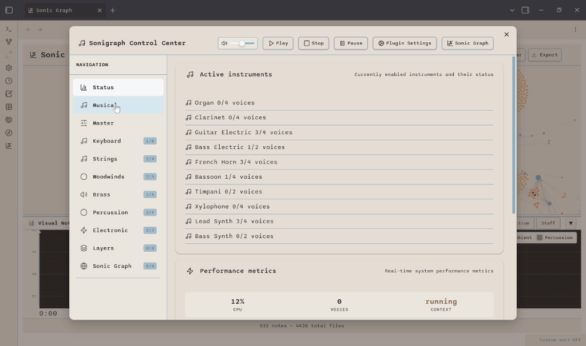

# Sonigraph

**Transform your knowledge graph into immersive orchestral soundscapes.**

Sonigraph is an Obsidian plugin that maps your vault's structure to music. Notes become instruments, connections become melodies, and your knowledge graph becomes an interactive orchestral composition you can explore, visualize, and export as audio.

<table align="center">
<tr>
<td align="center" width="50%">

 
<em>Control Center: 35-Instrument Orchestra Management</em>
</td>
<td align="center" width="50%">

 
<em>Sonic Graph: Timeline Animation & Visual Display</em>
</td>
</tr>
</table>

---

## What is Sonigraph?

Sonigraph turns your Obsidian vault into an interactive musical instrument. The plugin analyzes your vault's structure - notes, links, tags, and metadata - then generates real-time orchestral music that represents your knowledge graph.

**Why Sonigraph?**
- **Discover Patterns**: Hear the structure of your knowledge in ways visualization alone can't reveal
- **Explore Context**: Navigate your vault through depth-based soundscapes
- **Create Artifacts**: Export timeline animations as shareable audio files
- **Enhance Focus**: Work with continuous ambient soundscapes that evolve with your vault

---

## Demo

**Watch Sonigraph in Action:**

*See Local Soundscape's depth-based exploration, real-time staff notation visualization, and the 35-instrument orchestral engine. Click to watch on YouTube.*

---

## Core Features

### 🎼 Two Listening Modes

**Timeline Animation (Sonic Graph)**
- Chronological playback of vault history with visual node animation
- Multi-level time granularity (year/month/week/day/hour)
- Piano roll, spectrum analyzer, and staff notation visualizations
- Professional audio export (WAV, M4A, OGG)

**Local Soundscape**
- Depth-based exploration from any note as starting point
- Context-aware modifiers (season, time of day, weather, theme)
- Force-directed graph layout with smart clustering
- Musical variation system to re-roll sonic interpretations

### 🎹 35-Instrument Orchestra

Full orchestral palette with real-time synthesis:
- **7 families**: Keyboard, Strings, Woodwinds, Brass, Vocals, Percussion, Electronic
- **Sample-based synthesis** for realistic orchestral timbres
- **Physics-modeled percussion** (timpani, mallet instruments, gongs)
- **Electronic synthesis** (lead, bass, arpeggiators with modulation)

### 🎨 Content-Aware Mapping

Intelligent instrument assignment based on:
- **File types**: Markdown, images, PDFs, audio, video trigger specific instrument families
- **Tags**: Vault tags drive musical mood (#contemplative, #energetic, #calm)
- **Folder hierarchy**: Organizational structure influences orchestral grouping
- **Frontmatter**: Explicit instrument and mood control via note metadata
- **Link types**: Wikilinks, embeds, and tag connections produce distinct sounds

### 🎚️ Professional Audio

- **Master effects**: Orchestral reverb hall, 3-band EQ, dynamic compression
- **11 effect presets**: Concert Hall, Jazz Club, Cathedral, Studio Dry, and more
- **Per-instrument chains**: Individual reverb, chorus, and filter for each instrument
- **Continuous layers**: Ambient, rhythmic, and harmonic background layers (13 genres)
- **Freesound.org integration**: Curated high-quality environmental samples

### 📊 Visual Feedback

- **Piano Roll**: Timeline-based scrolling display with moving playhead
- **Spectrum Analyzer**: Real-time frequency visualization (64 bars, 60fps)
- **Staff Notation**: Traditional treble/bass clef with MIDI pitch mapping
- **Graph Highlighting**: Nodes pulse when their associated notes play

---

## Installation

**Recommended:** Install via [BRAT Plugin](https://github.com/TfTHacker/obsidian42-brat)

1. Install the BRAT plugin in Obsidian
2. Use BRAT to install from GitHub: `banisterious/obsidian-sonigraph`
3. Enable Sonigraph in Community Plugins settings

**Manual Installation:** Download the latest release and extract to your vault's `.obsidian/plugins/` folder

---

## Quick Start

### Basic Usage

1. **Open Control Center**: Click the music note icon in the ribbon or use command palette
2. **Configure Orchestra**: Visit instrument family tabs (Strings, Brass, Woodwinds, etc.)
3. **Adjust Master Settings**: Set tempo, scale, and master effects in the **Master** tab
4. **Play Timeline**: Open **Sonic Graph** tab and click Play to hear your vault's history

### Continuous Layers (Optional)

1. **Get API Token**: Create a free account at [Freesound.org](https://freesound.org) and apply for an [API token](https://freesound.org/apiv2/apply)
2. **Configure Layers**: Go to **Continuous Layers** tab, enter your token
3. **Select Genre**: Choose from 13 genres (Ambient Drone, Cinematic Orchestral, Jazz Lounge, etc.)
4. **Download Samples**: Browse and download curated samples directly in the interface
5. **Enable Layers**: Toggle ambient, rhythmic, and harmonic layers on/off

### Local Soundscape

1. **Open Note**: Navigate to any note in your vault
2. **Context Menu**: Right-click in the editor → "Open in Local Soundscape"
3. **Explore Context**: See connections at multiple depths with radial layout
4. **Apply Modifiers**: Enable season, time, weather, or theme-based audio variations
5. **Auto-Play**: Toggle auto-play to hear soundscapes when opening notes

---

## Documentation

- **[Complete Feature List](docs/features.md)** - Detailed feature documentation
- **[Architecture Overview](docs/architecture/overview.md)** - Technical design and system components
- **[Development Roadmap](docs/planning/development-roadmap.md)** - Future features and milestones
- **[Contributing Guide](contributing.md)** - Code quality standards and development workflow

---

## Support My Work

If you find this plugin useful, please consider supporting its development!

---

## Current Version

**v0.17.14** - Production Ready

**Latest Updates:**
- Resolved all PR review round 8 ESLint issues: 364 total fixes across 5 categories (v0.17.14)
- Standardized UI text to sentence case for consistency across all settings (v0.17.14)
- Harmonium instrument added to keyboard family (35 total instruments) (v0.17.12)
- Resolved 441 PR review issues: Removed all eslint-disable-line directives (v0.17.12)
- Fixed Piano Roll visualization: Corrected timeline display and playhead sync (v0.17.12)
- Local Soundscape performance: Eliminated 5+ second initialization delay (v0.17.12)

See [CHANGELOG.md](CHANGELOG.md) for complete version history.

---

## Contributing

Contributions are welcome! Sonigraph has reached production status with comprehensive orchestral capabilities.

**Areas for contribution:**
- New instrument synthesis methods
- Additional effect processing algorithms
- Enhanced graph-to-music mapping strategies
- Performance optimizations for large vaults
- UI/UX improvements and accessibility features

See [contributing.md](contributing.md) for development setup, code quality standards, and audit workflow.

---

## License

MIT License - see [LICENSE](LICENSE) for details.

---

## Acknowledgments

- Built for [Obsidian](https://obsidian.md)
- Audio synthesis powered by [Tone.js](https://tonejs.github.io/)
- Samples provided by [Freesound.org](https://freesound.org)
- Inspired by data sonification and knowledge visualization research

---

**Note**: This plugin is not affiliated with or endorsed by Obsidian.md.
