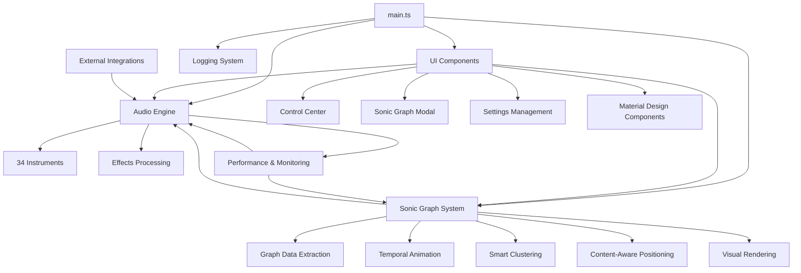

# Sonigraph Architecture Overview

## Table of Contents

- [1. System Overview](#1-system-overview)
  - [1.1. Core Components](#11-core-components)
  - [1.2. Technology Stack](#12-technology-stack)
  - [1.3. Module Structure](#13-module-structure)
- [2. Architecture Documents](#2-architecture-documents)
- [3. Component Relationships](#3-component-relationships)
- [4. Getting Started](#4-getting-started)

---

## 1. System Overview

### 1.1. Core Components

Sonigraph is built on a modular architecture designed for scalability and maintainability:

- **AudioEngine**: Orchestral audio synthesis with 34 instruments
- **Graph Parser**: Obsidian vault data extraction and processing
- **Musical Mapper**: Graph-to-music parameter conversion
- **Control Center**: Professional 6-tab Material Design interface
- **Logging System**: Enterprise-grade logging with multiple adapters
- **Effects Engine**: Per-instrument effects processing with master bus
- **Sonic Graph System**: Dynamic graph visualization and interaction

### 1.2. Technology Stack

**Core Technologies:**
- **Language**: TypeScript with strict type checking
- **Audio Framework**: Tone.js v14.8.49 for Web Audio synthesis
- **Build System**: ESBuild for fast compilation and bundling
- **Plugin API**: Obsidian Plugin API with full type definitions
- **UI Framework**: Custom Material Design components

**Dependencies:**
- `tone`: Advanced audio synthesis and effects
- `obsidian`: Plugin API types and utilities
- Build tools: ESBuild configuration for production builds

### 1.3. Module Structure

```
src/
├── main.ts                 # Plugin entry point and lifecycle
├── graph/
│   ├── parser.ts          # Vault data extraction
│   ├── musical-mapper.ts  # Graph-to-music mapping
│   ├── GraphDataExtractor.ts # Sonic Graph data extraction and filtering
│   ├── GraphRenderer.ts   # D3.js-based visualization
│   ├── TemporalGraphAnimator.ts # Timeline animation system
│   ├── ContentAwarePositioning.ts # Semantic force positioning system
│   ├── SmartClusteringAlgorithms.ts # Community detection and clustering
│   └── types.ts           # Graph data interfaces
├── audio/
│   ├── engine.ts          # Main orchestral audio engine
│   ├── harmonic-engine.ts # Harmonic processing
│   ├── percussion-engine.ts # Advanced percussion synthesis
│   └── electronic-engine.ts # Electronic synthesis suite
├── ui/
│   ├── control-panel.ts   # Control Center with Sonic Graph integration
│   ├── SonicGraphModal.ts # Main Sonic Graph interface
│   ├── FolderSuggestModal.ts # Folder exclusion autocomplete
│   ├── FileSuggestModal.ts # File exclusion autocomplete
│   ├── settings.ts        # Settings management
│   ├── components.ts      # Reusable UI components
│   ├── lucide-icons.ts    # Icon system integration
│   └── material-components.ts # Material Design components
├── utils/
│   ├── constants.ts       # Configuration and defaults
│   └── [utilities]
└── logging.ts             # Logging system
```

## 2. Architecture Documents

This section provides links to detailed architecture documentation for each major system:

### **Core Systems**

- **[Sonic Graph System](sonic-graph-system.md)** - Comprehensive graph visualization with temporal animation, smart clustering, and content-aware positioning
- **[Audio Engine](audio-engine.md)** - 34-instrument orchestral synthesis with effects processing and performance optimization
- **[UI Components](ui-components.md)** - Material Design interface system and Obsidian integration
- **[CSS System](css-system.md)** - Modular CSS architecture, build system, and design tokens
- **[Logging System](logging-system.md)** - Enterprise-grade logging with multiple adapters and structured output

### **Specialized Systems**

- **[Performance & Monitoring](performance.md)** - Performance optimization strategies and real-time monitoring
- **[External Integrations](external-integrations.md)** - CDN sample sources, whale audio, and third-party services

### **Reference Documentation**

- **[API Reference](api-reference.md)** - Complete API interfaces and usage examples

## 3. Component Relationships



**Key Interactions:**

1. **Main Plugin** orchestrates all systems and handles lifecycle
2. **Sonic Graph System** extracts vault data and creates visualizations
3. **Audio Engine** synthesizes music based on graph data
4. **UI Components** provide user interaction and settings management
5. **External Integrations** enhance audio quality with external samples
6. **Performance & Monitoring** ensures optimal system operation

## 4. Getting Started

### **For Developers**

1. **Start with**: [Audio Engine Architecture](audio-engine.md) to understand the core synthesis system
2. **Then explore**: [Sonic Graph System](sonic-graph-system.md) for graph visualization and interaction
3. **UI Development**: [UI Components](ui-components.md) for interface and Material Design implementation
4. **Performance**: [Performance & Monitoring](performance.md) for optimization strategies

### **For Contributors**

1. **Architecture Understanding**: Read this overview and the core system docs
2. **Development Setup**: See main README.md for build and development instructions
3. **Testing**: [API Reference](api-reference.md) includes testing interfaces and examples
4. **Integration**: [External Integrations](external-integrations.md) for adding new external services

### **For System Integration**

1. **Plugin Integration**: [UI Components](ui-components.md) covers Obsidian-specific integration patterns
2. **Audio Integration**: [Audio Engine](audio-engine.md) documents the synthesis system and external sample loading
3. **Performance Requirements**: [Performance & Monitoring](performance.md) details system requirements and optimization

---

*This document provides a high-level overview of the Sonigraph architecture. For detailed implementation information, refer to the specific architecture documents linked above.*